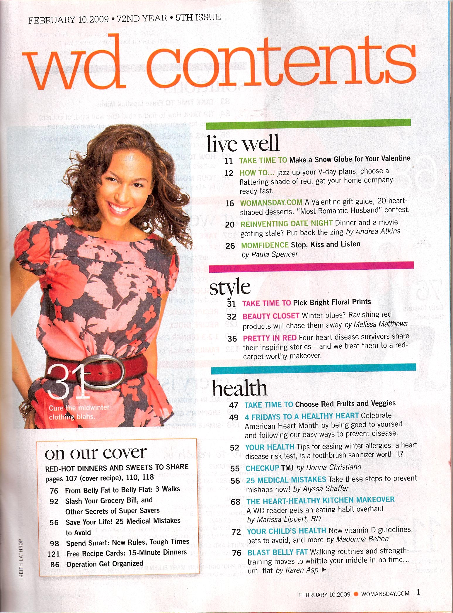
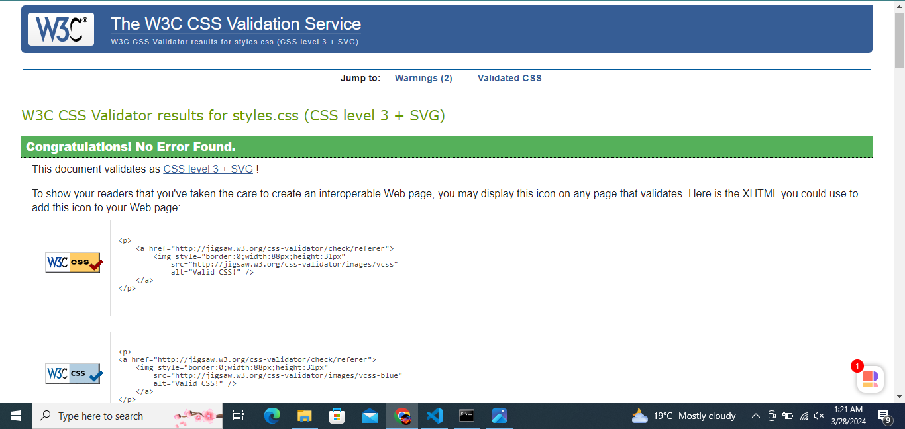
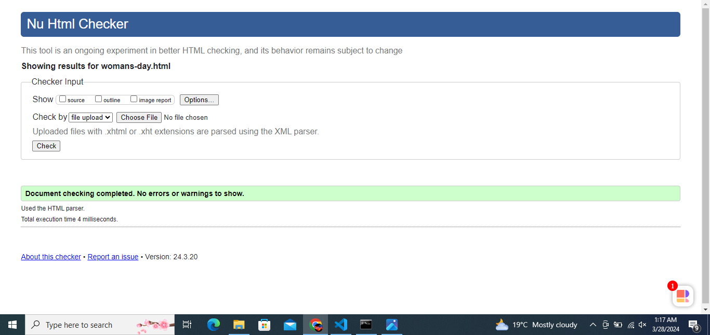
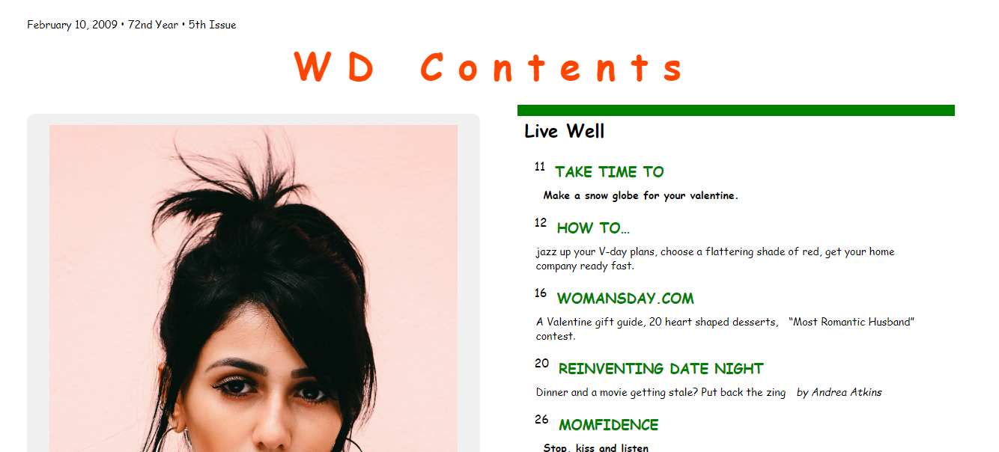
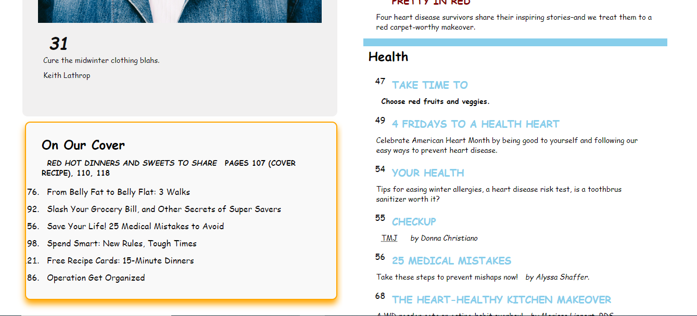

# assignment2-comp1054

# Woman’s Day Magazine Layout Reconstruction

## Description

This project aims to faithfully reconstruct the layout of a selected magazine article from Woman’s Day using HTML and original CSS, adhering to web standards and best practices.

## Assignment Content

### Selection

The selected article for reconstruction is titled "WD Contents" from Woman’s Day magazine, dated February 10, 2009.
This  is  the  Scanned image

### Instructions Followed

1. **HTML Examination**: The provided HTML document representing the content structure of the article has been thoroughly examined.
2. **HTML Modification**: Minimal modification has been applied to the HTML document, primarily focusing on CSS implementation.
3. **CSS Implementation**: Original CSS has been developed to reproduce the print layout in a web-appropriate format, respecting web design principles.
4. **Image Substitution**: Original images have been used to substitute for the ones in the provided article for better resolution and web compatibility.
5. **Validation**: Both HTML and CSS code have been validated using the W3C Markup Validation Service and the W3C CSS Validation Service, respectively.

## Validation

## Result

The resulting web layout closely resembles the original magazine layout while respecting web design standards and limitations.

### Screenshots
### 1

### 2

### 3

